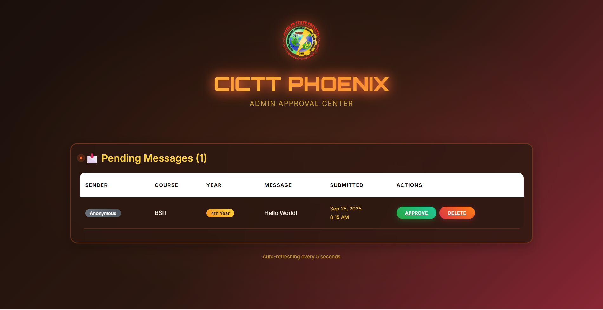
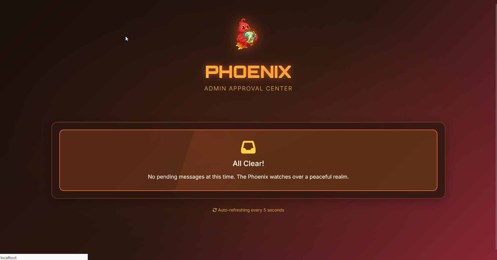
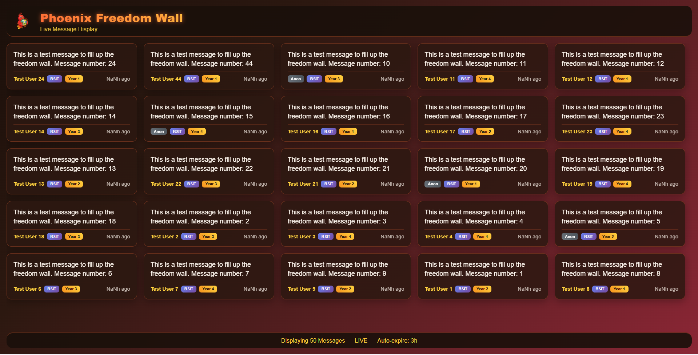
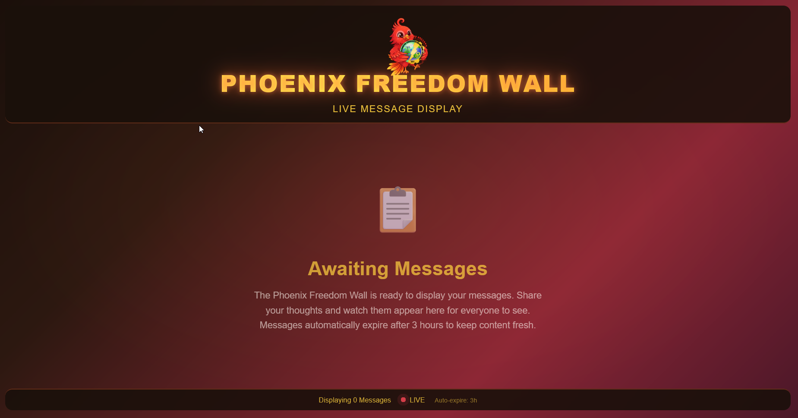
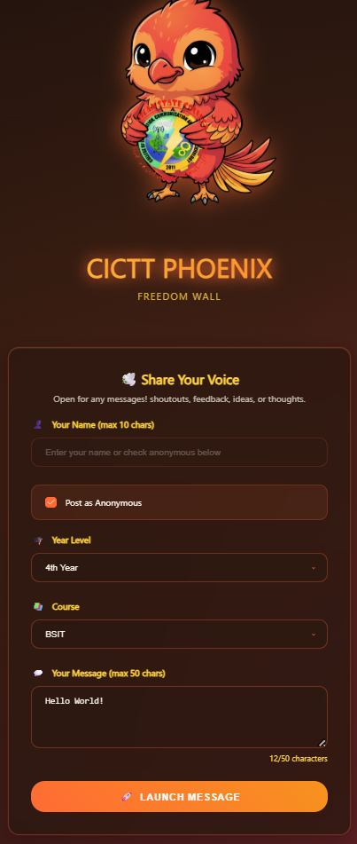

# Phoenix Freedom Wall 🚀🔥

A student-friendly message wall with admin approval system.

A flowchart illustrating the user and system interactions for the Phoenix Freedom Wall

This system has three primary components: the user submission form, the admin approval panel, and the public live display.

### **User Interaction Flow**

This path shows how a student or any general user submits a message.

```
            ┌──────────────────────┐
            │   Student / User     │
            └──────────────────────┘
                    │
                    ▼
┌────────────────────────────────────┐
│ 1. Submission Portal (index.php)   │  ← User fills form: Name, Year, Course, Message.
└────────────────────────────────────┘      Can also select "Anonymous".
                    │
                    ▼
┌────────────────────────────────────┐
│ 2. System: Validation & Spam Check │  ← Checks character limits and 60s cooldown.
└────────────────────────────────────┘
                    │
         ┌──────────┴──────────┐
         ▼                     ▼
┌──────────────────┐  ┌─────────────────────────────────┐
│ On Error         │  │ On Success                      │
│                  │  │                                 │
│ Redisplay form   │  │ Store message in Database       │
│wth error message.│  │ with status set to "Pending".   │
└──────────────────┘  └─────────────────────────────────┘
                                     │
                                     ▼
                      ┌─────────────────────────────────┐
                      │ User sees success message:      │
                      │ "Pending admin approval."       │
                      └─────────────────────────────────┘
```

-----

### **Admin Interaction Flow**

This path shows how an administrator moderates the submitted messages.

```
            ┌──────────────────────┐
            │         Admin        │
            └──────────────────────┘
                    │
                    ▼
┌────────────────────────────────────┐
│ 1. Admin Login (auth.php)          │  ← Secure access to the dashboard.
└────────────────────────────────────┘
                    │
                    ▼
┌────────────────────────────────────┐
│ 2.Admin Dashboard (admin.index.php)│ ← System fetches all "Pending" messages.
└────────────────────────────────────┘
                    │
                    ▼
┌────────────────────────────────────┐
│ 3. Admin Reviews Pending Messages  │
└────────────────────────────────────┘
                    │
         ┌──────────┴──────────┐
         ▼                     ▼
┌──────────────────┐  ┌─────────────────────────────────┐
│ Action: Approve  │  │ Action: Delete                  │
│                  │  │                                 │
│ System updates   │  │ System permanently removes      │
│ message status   │  │ the message from the Database.  │
│ to "Approved".   │  │                                 │
└──────────────────┘  └─────────────────────────────────┘
         │
         └──────────┐
                    ▼
```

-----

### **System & Database Flow**

This shows how the database and the automated live display screen interact.

```
                    ▼
┌────────────────────────────────────┐
│    MySQL Database ("messages" table) │  ← Central storage for all message data.
└────────────────────────────────────┘
                    ▲
         ┌──────────┴──────────┐
         │                     │
         ▼                     ▼
┌──────────────────┐  ┌─────────────────────────────────┐
│ 4. Live Display  │  │ 5. System: Auto-Cleanup         │
│    (home.php)    │  │                                 │
│                  │  │ System automatically deletes    │
│ Fetches & shows  │  │ "Approved" messages that are    │
│ "Approved"       │  │ older than 3 hours from the     │
│ messages.        │  │ Database to keep content fresh. │
└──────────────────┘  └─────────────────────────────────┘
         │
         ▼
┌────────────────────────────────────┐
│ Display screen rotates through     │  ← TV screen visible to the public.
│ messages and auto-refreshes for    │    Refreshes every 5s for new content.
│ new content.                       │    Rotates pages every 10s.
└────────────────────────────────────┘
```
# Message Submission and Moderation System


***

## 1. User Submission Algorithm


1.  **Access:** A student or user accesses the **Submission Portal**.
2.  **Form Completion:** The user fills out a form, providing their name, year, course, and message. They also have the option to submit anonymously.
3.  **Validation:** The system performs an automated validation and spam check on the submission.
    * This includes checking for character limits.
    * A 60-second cooldown period is enforced to prevent spam.
4.  **Error Handling:** If the submission has an error, the form is redisplayed to the user with an error message.
5.  **Successful Submission:** If the submission is successful, the message is stored in the database with its status set to **"Pending"**.
6.  **Confirmation:** The user sees a success message confirming that their submission is pending admin approval.

***

## 2. Admin Moderation Algorithm


1.  **Login:** An admin logs into the system using the secure **Admin Login** portal.
2.  **Dashboard Access:** The Admin Dashboard fetches and displays all messages that have a status of **"Pending"**.
3.  **Review:** The admin reviews the pending messages.
4.  **Action:** The admin can take one of two actions for each message:
    * **Approve:** The system updates the message's status in the database to **"Approved"**.
    * **Delete:** The system permanently removes the message from the database.

***

## 3. System and Live Display Algorithm


1.  **Live Display:** The Live Display screen fetches and shows messages that have an **"Approved"** status from the MySQL database.
2.  **Display Refresh:** The display automatically refreshes every 5 seconds for new content and rotates through the messages every 10 seconds.
3.  **Auto-Cleanup Process:** The system runs an automated Auto-Cleanup process.
    * This process automatically deletes any **"Approved"** messages from the database that are older than three hours to keep the content fresh.


## 📸 Screenshots

### 🔑 Admin Approval Center


### ✅ No Pending Messages


### 📝 Freedom Wall with Messages


### ⏳ Awaiting Messages


### 📱 Mobile View

---

<p align="center">
  
  
</p>
